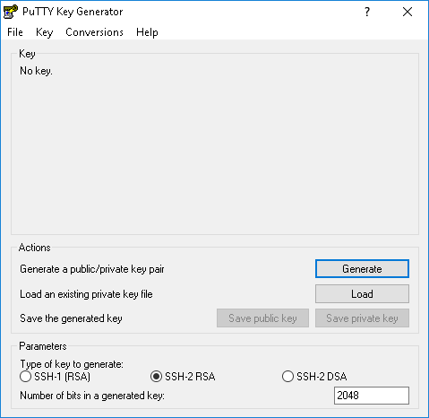
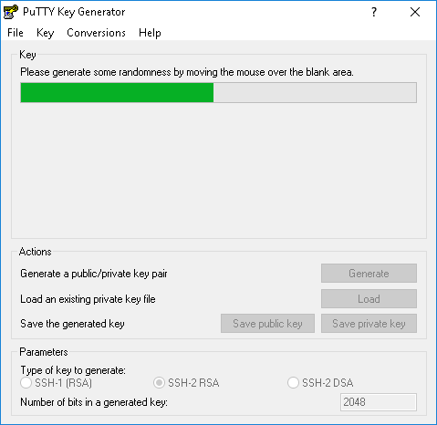
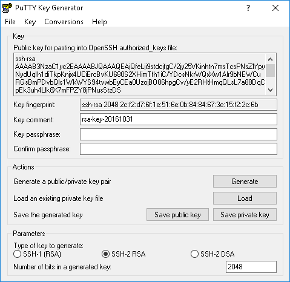
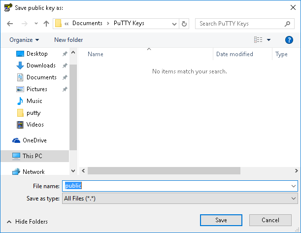
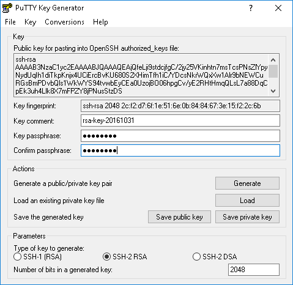
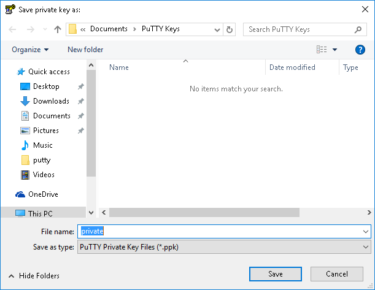

Δημιουργία κλειδιών κρυπτογράφησης
----------------------------------

Αν χρησιμοποιείτε *Windows* μια λύση είναι να χρησιμοποιήσετε το πρόγραμμα [PuTTY Key Generator](https://the.earth.li/~sgtatham/putty/latest/x86/puttygen.exe). Αφού το ξεκινήσετε και πατήσετε το κουμπί `Generate` θα πρέπει να κινήσετε το ποντίκι σας πάνω στη λευκή περιοχή έως ότου παραχθεί αρκετή τυχαιότητα για τη δημιουργία των κλειδιών σας. Μόλις δημιουργηθούν τα κλειδιά θα πρέπει να τα σώσετε στον υπολογιστή σας για την μελλοντική τους χρήση σαν κλειδιά πρόσβασης στην υποδομή του grid του ΚΗΥ.

Μπορείτε για παράδειγμα να δημιουργήσετε ένα κατάλογο `PuTTY Keys` για να αποθηκεύσετε τα κλειδιά σας. Σώστε το *δημόσιο* κλειδί (κουμπί `Save public key`) με κάποιο όνομα, π.χ. `public`. Κατά τη διάρκεια της αποθήκευσης του ιδιωτικού σας κλειδιού (κουμπί `Save private key`) σας συμβουλεύουμε να εφοδιάσετε το κλειδί σας με ένα συνθηματικό *passphrase* έτσι ώστε να είναι ασφαλέστερη η χρήση του. Αυτό σημαίνει ότι κάθε φορά πριν τη χρήση του κλειδιού σας θα σας γίνεται ερώτηση για το μυστικό *passphrase* που θα πρέπει να απαντηθεί ορθά για να συνεχίστε.

