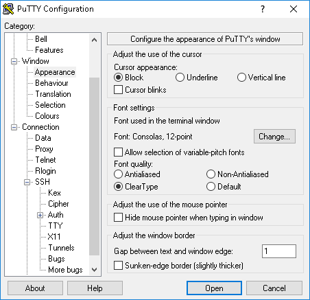
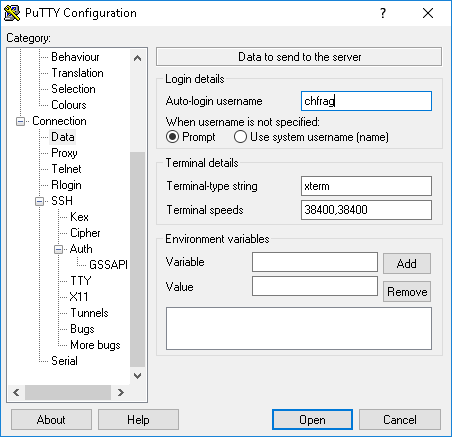
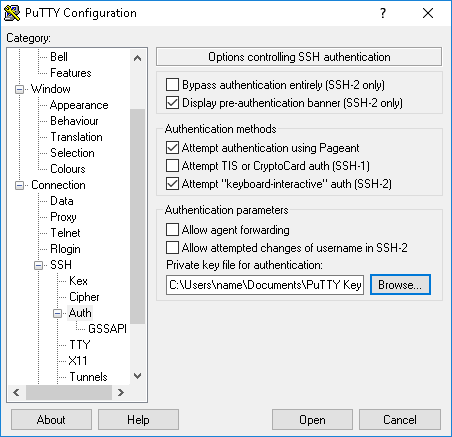
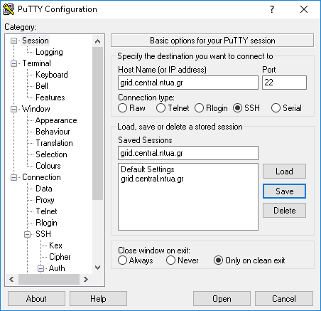
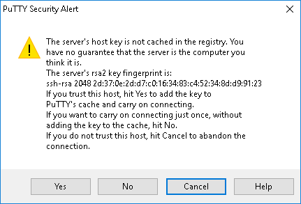
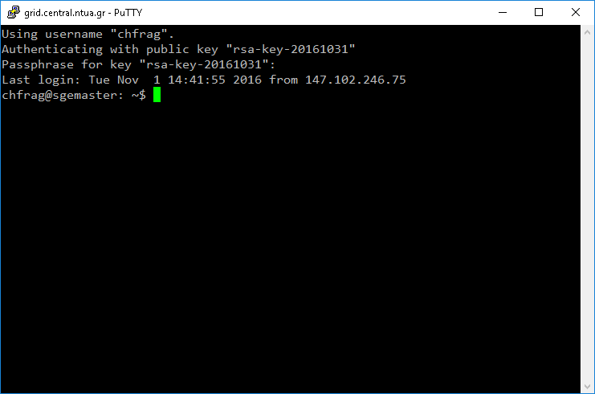

Πρόσβαση με Secure Shell
------------------------

Αν χρησιμοποιείτε Linux ή Mac υπολογιστή ανοίξτε ένα terminal και δώστε την εντολή
```
ssh -i /path/to/rsa -C username@grid.central.ntua.gr
```
Αν υπάρξει πρόβλημα σύνδεσης τις περισσότερες φορές συνδέεται με τα permissions των κλειδιών κρυπτογράφησης:
```
chmod 600 /path/to/rsa
```

Αν χρησιμοποιείτε *Windows* μια λύση είναι να χρησιμοποιήσετε το πρόγραμμα [PuTTY](https://the.earth.li/~sgtatham/putty/latest/x86/putty.exe). Για καλύτερη εμφάνιση σας προτείνουμε να ενεργοποιήσετε στην ενότητα `Window>Appearence` τη γραμματοσειρά `Consolas` και τη ρύθμιση `ClearType`. Για να επιλέγεται αυτόματα το όνομα χρήστη σας όπως και το προσωπικό σας κλειδί κρυπτογράφησης εισάγετε τις αντίστοιχες πληροφορίες στις ενότητες `Connection>Data` και `Connection>SSH>Auth`.





Σώστε τις επιλογές σας σε ένα session name έτσι ώστε κάθε επόμενη φορά να επιλέγετε το session και στη συνέχεια `Load`. Την πρώτη φορά που θα συνδεθείτε θα εμφανιστεί ένα παράθυρο με τίτλο `PuTTY Security Alert` όπου θα πρέπει να επιλέξετε το `Yes` για να συνδεθείτε επιτυχώς. Αν έχετε εφοδιάσει το προσωπικό σας κλειδί με Passphrase πρέπει να το πληκτρολογήσετε και αμέσως μετά θα μπορείτε να χρησιμοποιήσετε την υποδομή του grid για να υποβάλετε τις δουλειές σας.



