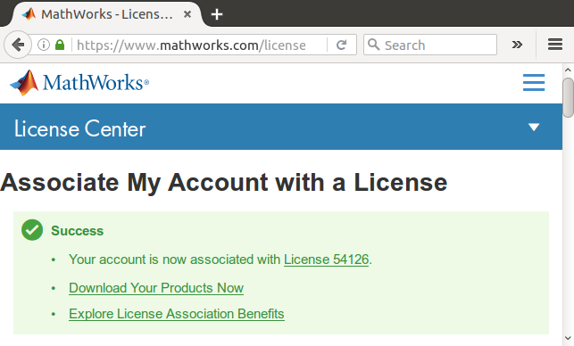
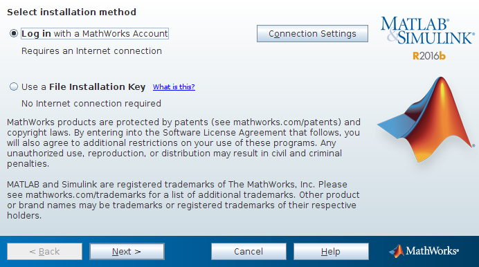
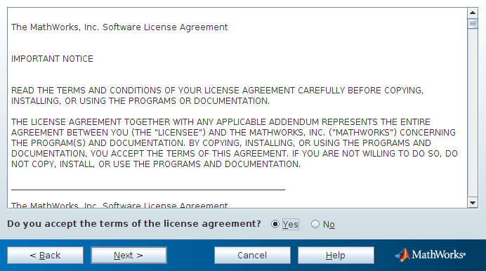
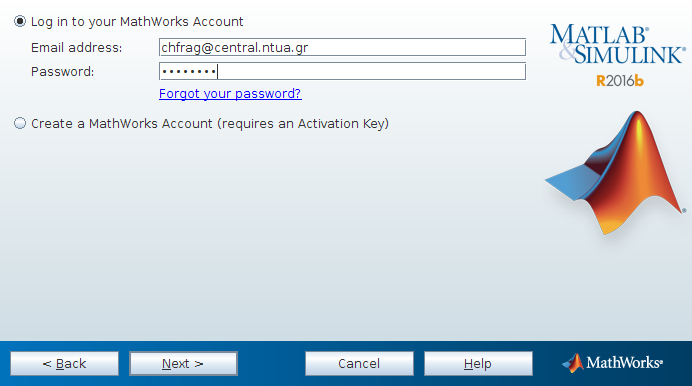
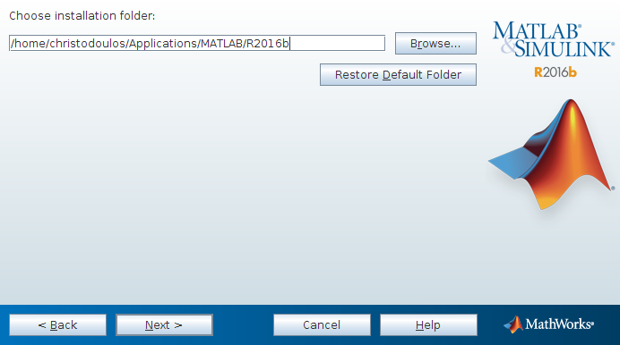
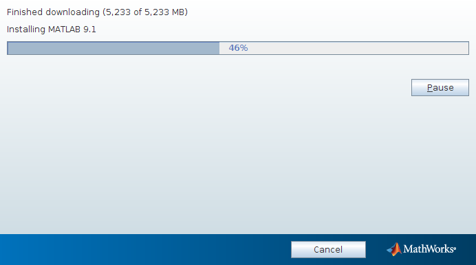
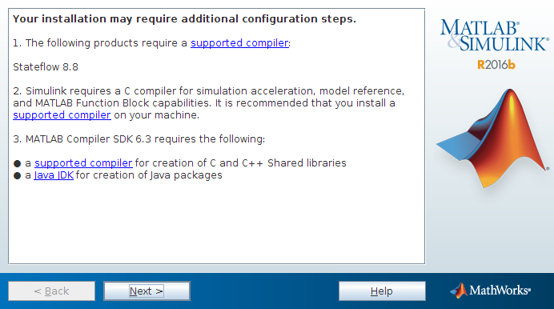
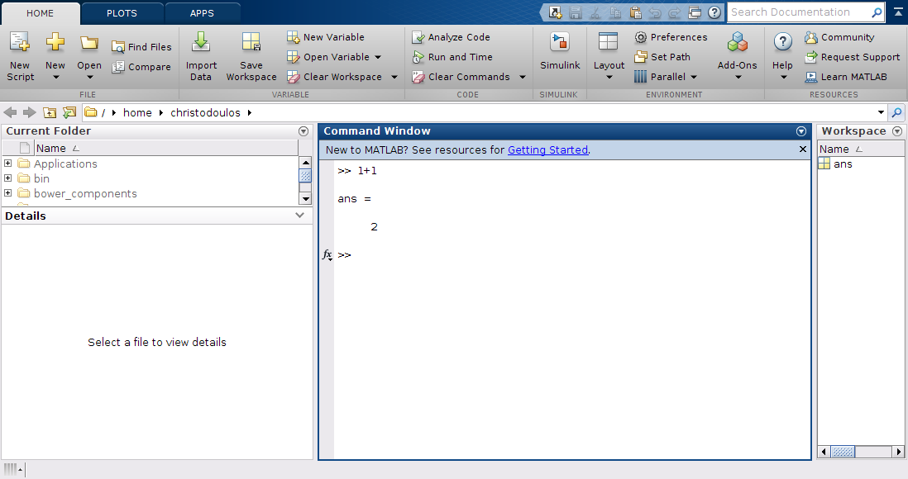

Matlab
======

Γενικά
------


Το Matlab είναι ένα διαδραστικό περιβάλλον για αριθμητικούς υπολογισμούς,
απεικόνιση και προγραμματισμό σε υψηλού επιπέδου γλώσσα. Χρησιμοποιώντας το
Matlab μπορείτε να αναλύσετε δεδομένα, να αναπτύξετε αλγόριθμους καθώς και να
δημιουργήσετε μοντέλα και εφαρμογές. Η γλώσσα, τα εργαλεία και οι ενσωματωμένες
μαθηματικές λειτουργίες σας δίνουν τη δυνατότητα πολλαπλές προσεγγίσεις και να
φτάσετε στη λύση των προβλημάτων σας ταχύτερα.

Μπορείτε να χρησιμοποιήσετε το Matlab για ένα ευρύ φάσμα εφαρμογών,
συμπεριλαμβανομένης της επεξεργασίας σήματος και επικοινωνιών, της επεξεργασίας
εικόνας και βίντεο, των συστημάτων ελέγχου, δοκιμών και μετρήσεων των
υπολογιστικών οικονομικών και της υπολογιστικής βιολογίας.

Διαθέσιμα toolboxes
-------------------

Στον παρακάτω πίνακα φαίνονται τα διαθέσιμα προϊόντα και toolboxes του Matlab.
Για λόγους καλύτερης εξυπηρέτησης των αναγκών του ΕΜΠ ένας αριθμός από
toolboxes σταμάτησε να συντηρείται στίς 31 Μαρτίου του 2015. Αυτό σημαίνει ότι ο
αριθμός των αδειών των toolboxes με αυτή την ημερομηνία είναι διαθέσιμος για
χρήση μόνο έως την έκδοση `2015a` του λογισμικού. Οι αριθμός των αδειών με
ημερομηνία λήξης συντήρησης 31 Μαρτίου 2017 είναι διαθέσιμος για χρήση με την
τρέχουσα έκδοση που είναι η `2016b`

|Product|Service End Date|Count|
|-------|----------------|-----|
|MATLAB|31 Mar 2017|120|
|Simulink|31 Mar 2017|50|
|Simulink|31 Mar 2015|70|
|Communications Blockset (Transitioned)|31 Dec 2011|2|
|Communications System Toolbox|31 Mar 2017|50|
|Communications System Toolbox|31 Mar 2015|70|
|Computer Vision System Toolbox|31 Mar 2017|1|
|Control System Toolbox|31 Mar 2017|50|
|Control System Toolbox|31 Mar 2015|10|
|Curve Fitting Toolbox|31 Mar 2017|50|
|Curve Fitting Toolbox|31 Mar 2015|10|
|DSP System Toolbox|31 Mar 2017|50|
|DSP System Toolbox|31 Mar 2015|70|
|Fuzzy Logic Toolbox|31 Mar 2017|25|
|Fuzzy Logic Toolbox|31 Mar 2015|5|
|Global Optimization Toolbox|31 Mar 2017|2|
|Image Processing Toolbox|31 Mar 2017|50|
|Image Processing Toolbox|31 Mar 2015|16|
|Instrument Control Toolbox|31 Mar 2017|1|
|MATLAB Compiler|31 Mar 2017|5|
|MATLAB Compiler SDK|31 Mar 2017|5|
|Mapping Toolbox|31 Mar 2017|5|
|Neural Network Toolbox|31 Mar 2017|5|
|Neural Network Toolbox|31 Mar 2015|25|
|Optimization Toolbox|31 Mar 2017|50|
|Optimization Toolbox|31 Mar 2015|70|
|Parallel Computing Toolbox|31 Mar 2017|11|
|RF Toolbox|31 Mar 2017|2|
|Signal Processing Toolbox|31 Mar 2017|50|
|Signal Processing Toolbox|31 Mar 2015|70|
|SimRF|31 Mar 2017|2|
|Simscape|31 Mar 2017|5|
|Simscape Electronics|31 Mar 2017|2|
|Simscape Fluids|31 Mar 2017|1|
|Simscape Power Systems|31 Mar 2017|2|
|Simulink Control Design|31 Mar 2017|10|
|Simulink Control Design|31 Mar 2015|50|
|Simulink Design Optimization|31 Mar 2017|1|
|Spline Toolbox (Transitioned)|31 Dec 2010|5|
|Stateflow|31 Mar 2017|1|
|Statistics and Machine Learning Toolbox|31 Mar 2017|50|
|Statistics and Machine Learning Toolbox|31 Mar 2015|70|
|Symbolic Math Toolbox|31 Mar 2017|50|
|Symbolic Math Toolbox|31 Mar 2015|70|
|System Identification Toolbox|31 Mar 2017|50|
|System Identification Toolbox|31 Mar 2015|10|

Προϋπόθεση για την εγκατάσταση
------------------------------

Για την προσωπική χρήση του Matlab για εκπαιδευτικούς και ερευνητικούς σκοπούς
είναι απαραίτητο να δημιουργηθεί προσωποποιημένη πρόσβαση στις σχετικές σελίδες
της εταιρείας Mathworks που παράγει το λογισμικό. Οι ενδιαφερόμενοι χρήστες
πρέπει να είναι κάτοχοι ιδρυματικού λογαριασμού email του τύπου
`<username>@central.ntua.gr` ή `<username>@mail.ntua.gr`.

License File
------------

Σε οποιαδήποτε τοπική εγκατάσταση είναι απαραίτητο να δημιουργήσετε κάπου στον
υπολογιστή σας ένα αρχείο με όνομα `matlab.lic` και περιεχόμενα:

```
SERVER licenses.central.ntua.gr 00163EE122D8 27001
USE_SERVER
```

Το συγκεκριμένο αρχείο θα το χρησιμοποιήσετε κατά τη διάρκεια της εγκατάστασης

Δημιουργία λογαριασμού στο site της Mathworks
---------------------------------------------

Αν δεν έχετε ήδη λογαριασμό στο site της Mathworks θα πρέπει να δημιουργήσετε
έναν χρησιμοποιώντας τον ιδρυματικό σας λογαριασμό email του τύπου
`<username>@central.ntua.gr`. Για να το κάνετε αυτό επιλέξτε το σύνδεσμο `Log
In` και στη συνέχεια `Create Account`. Θα πρέπει να συμπληρώσετε διάφορα
στοιχεία και στο τέλος η Mathworks θα αποστείλει ένα μήνυμα επιβεβαίωσης για να
ολοκληρωθεί η δημιουργία του λογαριασμού σας.

Σύνδεση του λογαριασμού σας με το License Number του ΕΜΠ
--------------------------------------------------------

Με δεδομένο λοιπόν το λογαριασμό σας στη σελίδα της Mathworks επιλέξτε `Log In`
και στη συνέχεια από το μενού που εμφανίζεται κάτω από το όνομά σας επιλέξτε
`Associate License`.


Πληκτρολογήστε τον αριθμό του License και πατήστε `Associate License`.  Αν η
σύνδεση πετύχει θα εμφανιστεί σχετικό μήνυμα.




Download του προγράμματος εγκατάστασης
--------------------------------------

Επιλέξτε `Download Your Products Now` στη συνέχεια την έκδοση του Matlab στο
λειτουργικό σύστημα που σας ενδιαφέρει.


Εγκατάσταση του Matlab
----------------------

Αφού αποσυμπιέσετε και ξεκινήσετε το πρόγραμμα εγκατάστασης ακολουθήστε τα
παρακάτω βήματα:




Χρησιμοποιήστε τα στοιχεία της πρόσβασής σας στη σελίδα της Mathworks




Επιλέξτε την τοποθεσία της εγκατάστασης και **μην επιλέξετε τον License
Manager**. Έχετε επίσης την δυνατότητα να απο-επιλέξετε toolboxes που
ενδεχομένως δεν χρειάζεστε.




Εισάγετε την τοποθεσία του αρχείου `matlab.lic` που ήδη έχετε φτιάξει και
αποθηκεύσει σε κάποια τοποθεσία του υπολογιστή σας.


Η εγκατάσταση θα ξεκινήσει.


Η εγκατάσταση θα διαρκέσει μερικά λεπτά καθώς θα κατεβαίνουν από τη Mathworks
τα κατάλληλα λογισμικά.




Όταν η εγκατάσταση ολοκληρωθεί θα μπορείτε να εκτελέσετε το Matlab στον
υπολογιστή σας. 



